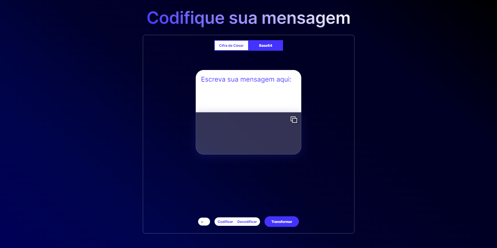

 # Criptografando 💻👨🏾‍💻
<h2>Cria um sistema de criptografia com Cifra de Cesar e Base64</h2>

- **Base64**: A codificação Base64 é um processo de conversão de dados binários em um formato de string ASCII, convertendo esses dados binários em uma representação de caracteres de 6 bits. O método Base64 de codificação é usado quando dados binários, como imagens ou vídeo, são transmitidos por sistemas projetados para transmitir dados em formato de texto simples (ASCII).

- **Cifra de César**: É um tipo de cifra de substituição na qual cada letra do texto é substituída por outra, que se apresenta no alfabeto abaixo dela um número fixo de vezes. Por exemplo, com uma troca de três posições, A seria substituído por D, B se tornaria E, e assim por diante. O nome do método é em homenagem a Júlio César, que o usou para se comunicar com os seus generais.

<h2>Funções da aplicação</h2>

- Você pode alterar entre Cifra de Cesar ou Base64.

- Você pode escolher entre codificar ou decodificar.

- Você pode alterar o numero de posições que irá ser trocado no alfabeto (no cifra de cesar).

- Após aparecer o resultado, você pode copia-lo utilizando o botão copy ao lado do resultado.

